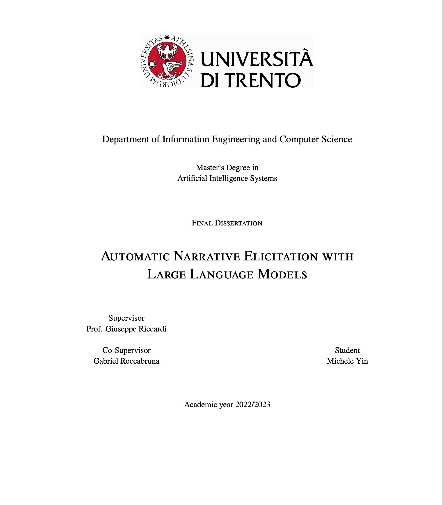
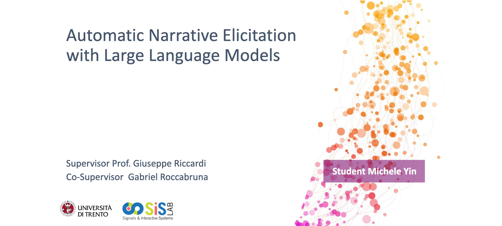

# Michele-Yin-Thesis

This repo contains my master's thesis pdf ( no data and no models, only .tex source ), which is a work on the use of Large Language Models for the task of ANE ( Automatic Narrative Elicitation )

**keywords**:

personal narrative, large language models, elicitation task, psychology, therapy

| <a href="https://github.com/BigEmperor26/Michele-Yin-Thesis/blob/main/lm_master_disi_en/Michele_Yin_Thesis_printout.pdf" target="_blank"><b>Thesis</b></a> | <a href="https://github.com/BigEmperor26/Michele-Yin-Thesis/blob/main/lm_master_disi_en/Thesis%20presentation.pdf" target="_blank"><b>Presentation</b></a> |
|--------------------------------------------------------------------------------------------------------------------------|---------------------------------------------------------------------------------------------------------------------------------|
|         |         |
